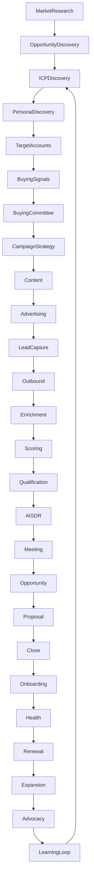

# Complete Revenue Lifecycle

## Stage inventory

Market research, opportunity discovery, ICP, persona, target accounts, buying signals, committee mapping, campaign, content, ads, social, landing pages, capture, outbound, enrichment, dedupe, intent, ICP score, lead score, qualification, AI SDR, multi-channel engagement, conversation, meeting, discovery, opportunity, solution, demo, technical discovery, business case, proposal, quote, approval, negotiation, procurement, legal, contract, close, onboarding, handoff, adoption, health, CS, QBR, upsell, cross-sell, renewal, expansion, advocacy, referral, learning.

Every stage is represented in the architecture. Implementation is phased. Closed Won must create Customer and Renewal stub records so post-sale modules are not blocked.
