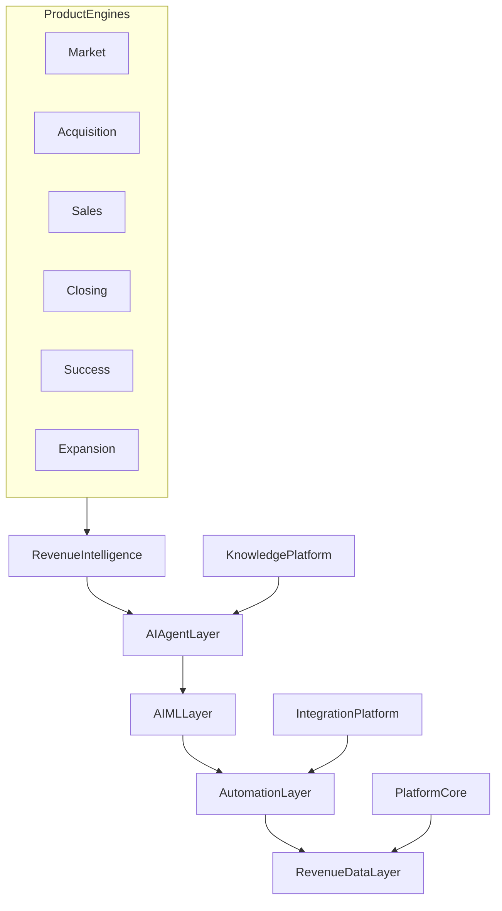

# Enterprise Architecture

## Seven product engines

1. Market Intelligence Engine
2. Demand and Acquisition Engine
3. Sales Execution Engine
4. Commercial and Closing Engine
5. Customer Success and Retention Engine
6. Expansion and Advocacy Engine
7. Revenue Intelligence and AI Engine

## Eight platform layers

1. AI Agent Platform
2. AI / ML Platform
3. Workflow and Automation Platform
4. Customer / Revenue Data Platform
5. Knowledge Platform
6. Integration Platform
7. Security and Governance Platform
8. Observability Platform

See [05-backend-architecture.md](05-backend-architecture.md) for module packages and [12-agent-architecture.md](12-agent-architecture.md) for the supervisor model.
