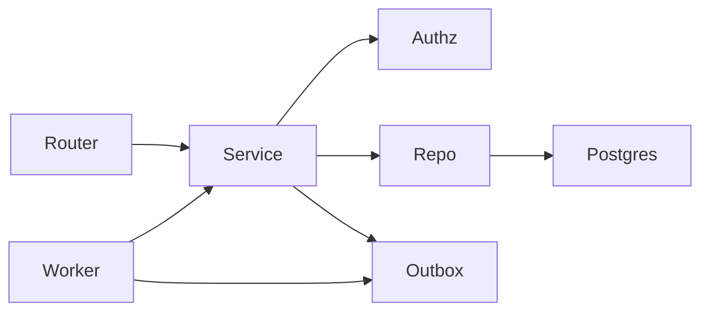

# Backend Architecture

Hexagonal layout inside `apps/api`.

```text
app/
  api/v1/          # HTTP adapters
  core/            # config, security, logging
  db/              # session, base
  models/          # SQLAlchemy
  schemas/         # Pydantic
  repositories/    # tenant-scoped data access
  services/        # application use cases
  workers/         # celery task entry (imported by apps/worker)
  ai/              # thin host for agent runtime
```

## Rules

- Routers do not contain business rules.
- Services enforce authorization context passed from dependencies.
- Repositories always take `tenant_id` for tenant-owned aggregates.
- Domain events are written to an outbox table, then published by the worker.


