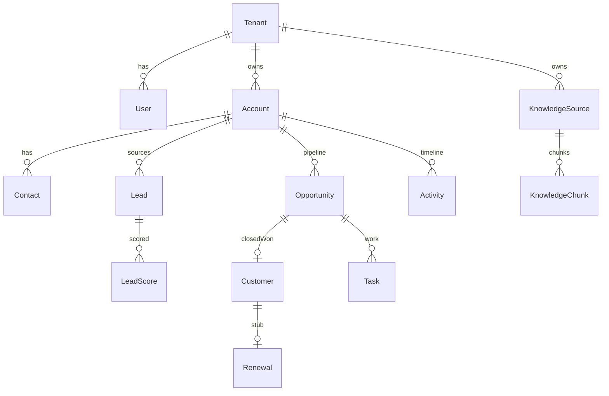

# Database Schema

## Shared columns

`id UUID PK`, `tenant_id`, `created_at`, `updated_at`, `created_by`, `updated_by`, optional `deleted_at`.

## Phase 1 — platform

`tenants`, `users`, `roles`, `permissions`, `role_permissions`, `user_roles`, `teams`, `team_members`, `regions`, `territories`, `refresh_tokens`, `audit_logs`, `feature_flags`.

## Phase 2 — revenue core

`accounts`, `contacts`, `account_contacts`, `leads`, `lead_scores`, `icps`, `opportunities`, `opportunity_stages`, `opportunity_line_items`, `tasks`, `activities`, `customers`, `renewals`, `next_best_actions`.

## Phases 4–6 — AI and knowledge

`prompts`, `agent_runs`, `tool_calls`, `model_usage`, `ai_approvals`, `ai_recommendations`, `ai_conversations`, `ai_messages`, `knowledge_sources`, `knowledge_chunks`, `workflow_definitions`, `workflow_runs`, `domain_events`.

## Future (do not migrate in MVP)

Ads, voice, contracts, CPQ, onboarding milestones, usage, support/finance signals, QBR, advocacy, referrals, partners, forecast snapshots, relationship graph.
