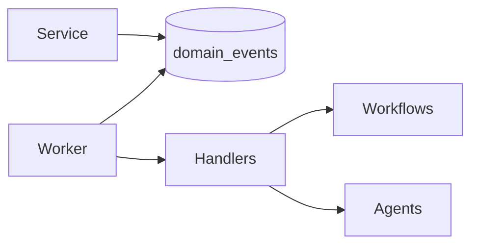

# Event Architecture

Transactional outbox: services write `domain_events` in the same commit as the mutation. The worker publishes and marks processed.

## Catalog (selected)

`account.created`, `lead.created`, `lead.scored`, `lead.qualified`, `opportunity.created`, `opportunity.stage_changed`, `deal.won`, `deal.lost`, `customer.created`, `handoff.created`, `onboarding.started`, `onboarding.milestone_due`, `onboarding.completed`, `customer.health_changed`, `customer.risk_detected`, `qbr.upcoming`, `renewal.window_opened`, `renewal.prepared`, `upsell.detected`, `cross_sell.detected`, `expansion.detected`, `advocacy.eligible`, `referral.received`, `ai.approval.requested`, `knowledge.source.ingested`, `discovery.ran`, `campaign.launched`, `voice.dialed`, `voice.status`, `voice.suppressed`, `meeting.requested`, `sequence.followup`.

External callbacks are at-least-once. Effectively-once business effects use inbox uniqueness, provider action idempotency keys, unique provider ids, and state checks.

Events carry `tenant_id`, `entity_type`, `entity_id`, `payload`, `occurred_at`, `correlation_id`.
