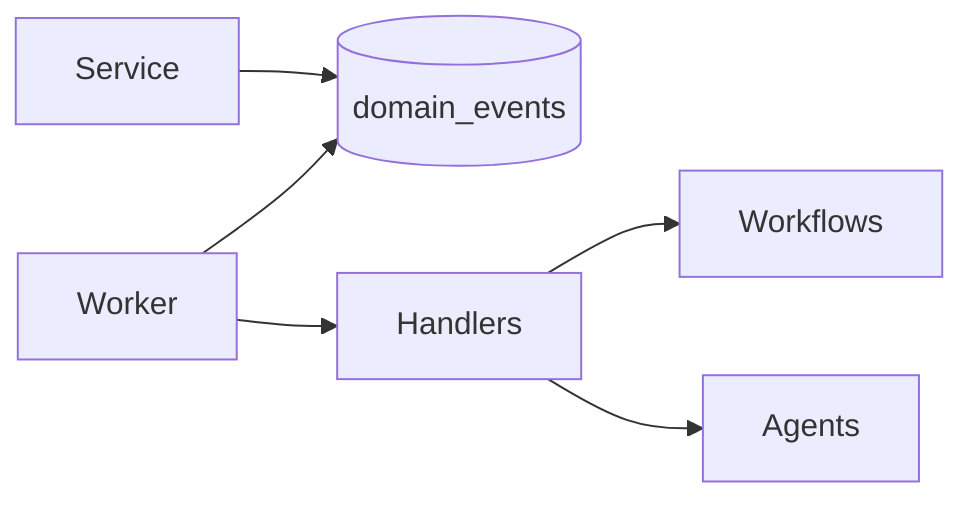

# Event Architecture

Transactional outbox: services write `domain_events` in the same commit as the mutation. The worker publishes and marks processed.

## Catalog (selected)

`account.created`, `lead.created`, `lead.scored`, `lead.qualified`, `opportunity.created`, `opportunity.stage_changed`, `deal.won`, `deal.lost`, `customer.created`, `renewal.upcoming`, `customer.health_changed`, `ai.approval.requested`, `knowledge.source.ingested`.

Events carry `tenant_id`, `entity_type`, `entity_id`, `payload`, `occurred_at`, `correlation_id`.
