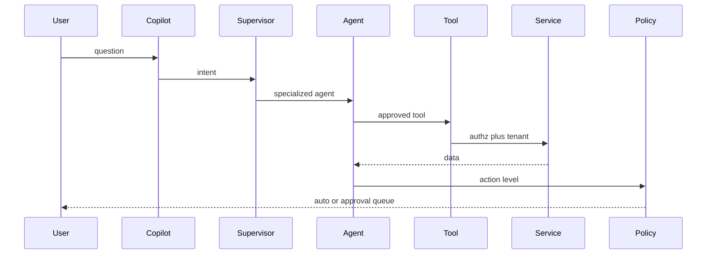

# Agent Architecture

Do not build one giant agent.

## Action levels

- 0 Read — auto
- 1 Internal write — tenant policy
- 2 External communication — communication policy, default approval
- 3 Commercial — approval rules
- 4 Financial / legal — explicit human authority

## MVP agents

Supervisor, Knowledge, AccountResearch, LeadScoring (explain only), Copilot tools for summaries and email draft. Other agents are registered contracts, not fake brains.
