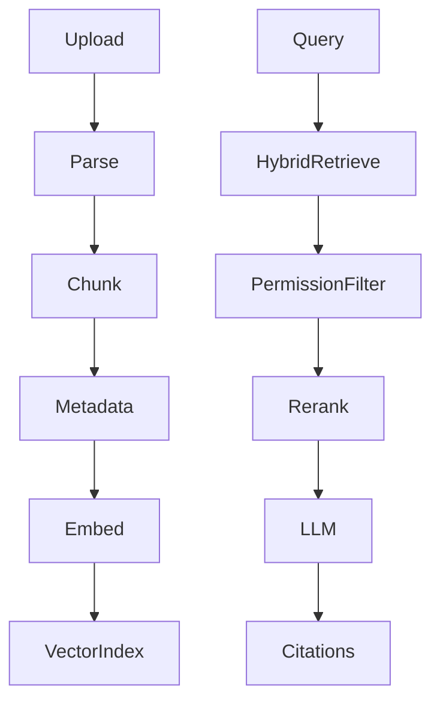

# RAG Architecture

Chunks store `tenant_id`, source id, ordinal, text, embedding, metadata. Retrieval is tenant-scoped. Answers must cite chunk ids or abstain. LLM never sees another tenant's chunks.
