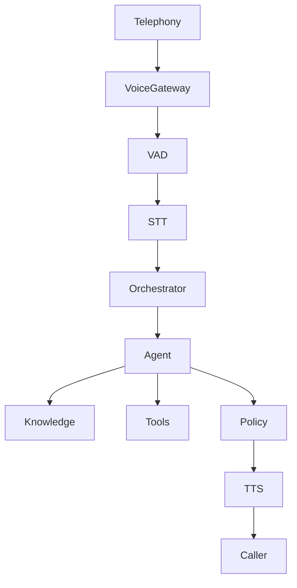

# Voice AI Architecture

Phase 11. **Implemented as stored transcripts and metadata only.** There is no live dialer. Voice rows are labeled mock when channel is voice.

Provider abstraction only until a telephony vendor is configured.

Store call metadata, transcript, summary, sentiment, qualification, objections, tasks, outcome, next action. Respect consent and applicable law. Do not ship live dialing in MVP.
