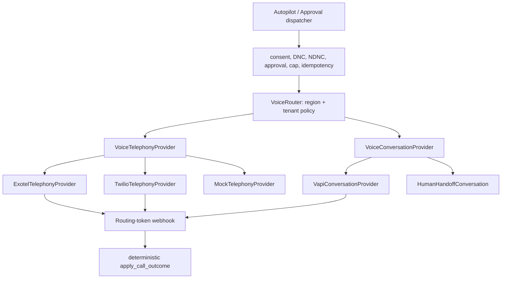

# Voice AI Architecture

Phase 11 plus live-channel batches. **A gated live dialer exists.** Autopilot never auto-approves a dial. Execution still requires voice consent (or an explicit request plus Approval), NDNC/DND and TRAI gates for India, daily caps, circuit breakers, and idempotency.

Telephony and conversation are independent providers. Destination region selects the carrier (`+91` → Exotel, otherwise Twilio) unless the tenant overrides the route. Vapi (or a human handoff) owns who speaks. Autopilot and deterministic outcome routing stay unchanged when a vendor is swapped.

## Honest webhook guarantees

Twilio and Vapi callbacks can be HMAC-verified. **Exotel does not HMAC-sign status callbacks.** Exotel ingest trusts the secret routing token on `/api/v1/webhooks/exotel/{token}` plus an optional IP allowlist. That is weaker than a signature and must not be described as one.

Store call metadata, transcript, summary, sentiment, qualification, objections, tasks, outcome, and next action. Record the chosen carrier and conversation provider on the session row. Respect consent and applicable law. Labeled mock never places a dial or invents a transcript.
