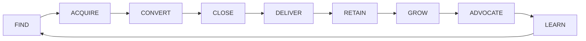
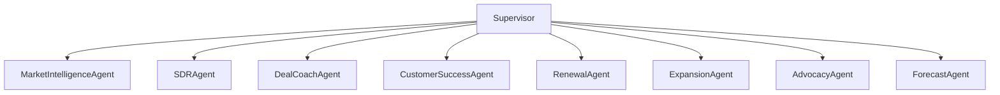
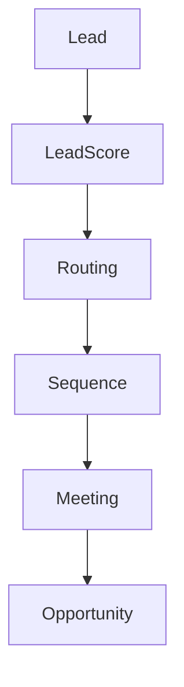
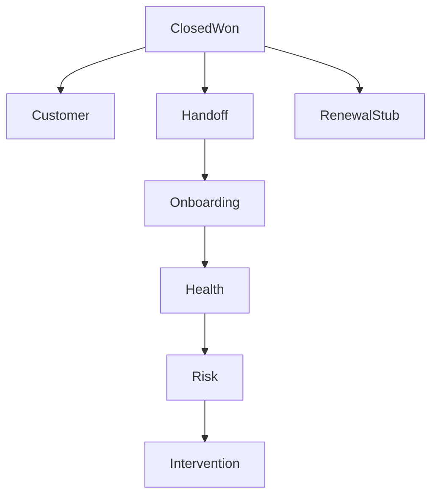
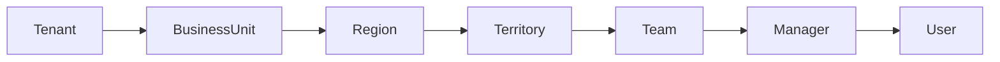
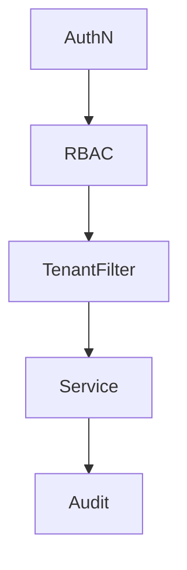
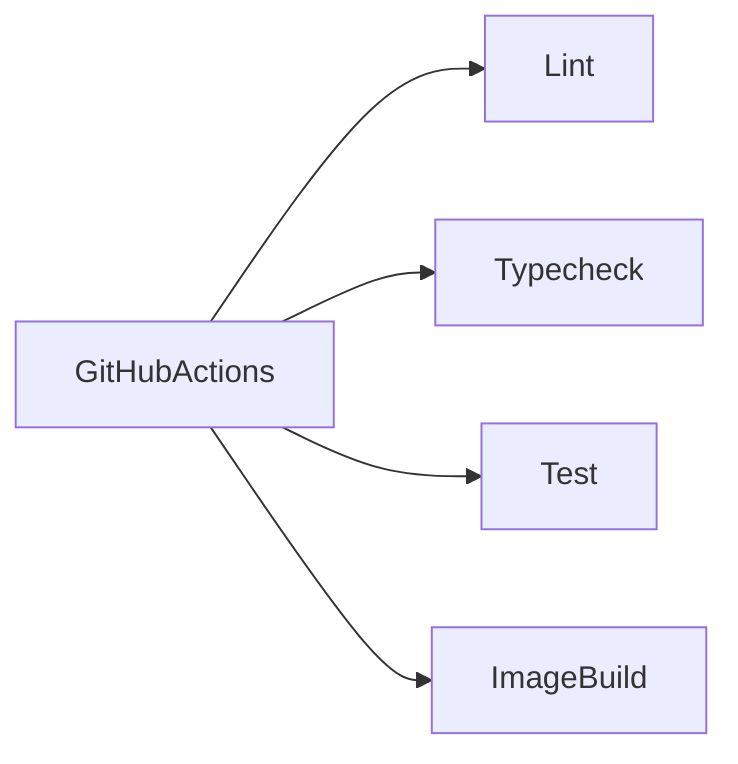
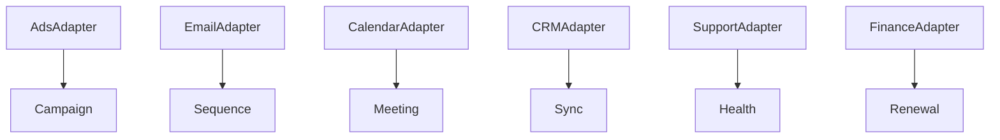

# Architecture Diagrams

Companion to docs 00–33. Additional flywheel and engine diagrams.

```mermaid
flowchart LR
  FIND --> ACQUIRE --> CONVERT --> CLOSE --> DELIVER --> RETAIN --> GROW --> ADVOCATE --> LEARN
  LEARN --> FIND
```

```mermaid
flowchart TD
  Supervisor --> MarketIntelligenceAgent
  Supervisor --> SDRAgent
  Supervisor --> DealCoachAgent
  Supervisor --> CustomerSuccessAgent
  Supervisor --> RenewalAgent
  Supervisor --> ExpansionAgent
  Supervisor --> AdvocacyAgent
  Supervisor --> ForecastAgent
```

```mermaid
flowchart TD
  Lead[Lead] --> Score[LeadScore]
  Score --> Route[Routing]
  Route --> Sequence[Sequence]
  Sequence --> Meeting[Meeting]
  Meeting --> Opportunity
```

```mermaid
flowchart TD
  ClosedWon --> Customer
  ClosedWon --> Handoff
  ClosedWon --> RenewalStub
  Handoff --> Onboarding
  Onboarding --> Health
  Health --> Risk
  Risk --> Intervention
```

```mermaid
flowchart LR
  Tenant --> BusinessUnit --> Region --> Territory --> Team --> Manager --> User
```

```mermaid
flowchart TD
  AuthN --> RBAC
  RBAC --> TenantFilter
  TenantFilter --> Service
  Service --> Audit
```

```mermaid
flowchart LR
  GitHubActions --> Lint
  GitHubActions --> Typecheck
  GitHubActions --> Test
  GitHubActions --> ImageBuild
```

```mermaid
flowchart TD
  AdsAdapter --> Campaign
  EmailAdapter --> Sequence
  CalendarAdapter --> Meeting
  CRMAdapter --> Sync
  SupportAdapter --> Health
  FinanceAdapter --> Renewal
```
